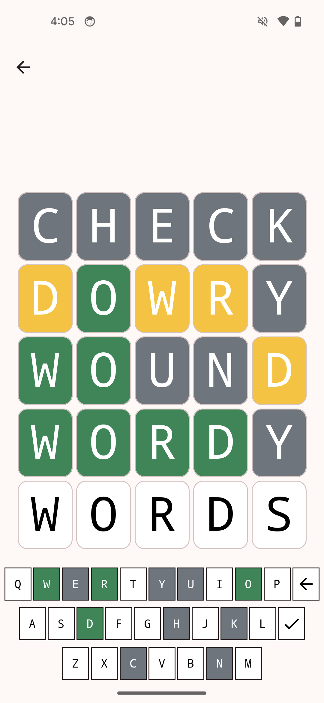

# Words

Words is a free, open source Wordle clone.

This app is the Android port of the [self-hosted web version](https://github.com/mcarr823/react-words).

* This app is a work-in-progress and is not yet functional.

## Credits

This app uses the Github icon provided by Github, per their [terms of use](https://github.com/logos).

Other icons are provided by Google under Apache License Version 2.0 as part of their [Material Icons](https://developers.google.com/fonts/docs/material_icons) library.

The source code for this app itself is GPLv3 licensed. See the [LICENSE file](./LICENSE).

The app's default word list is provided by [Heroku App's API](https://random-word-api.herokuapp.com/home).