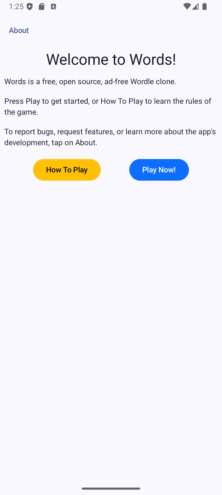
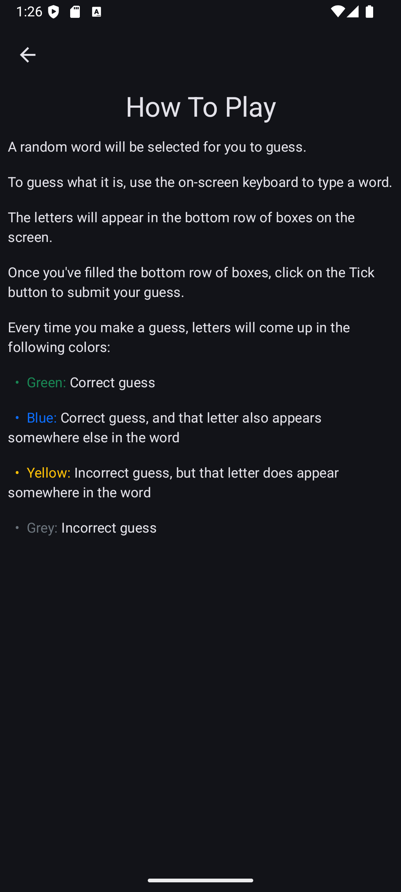
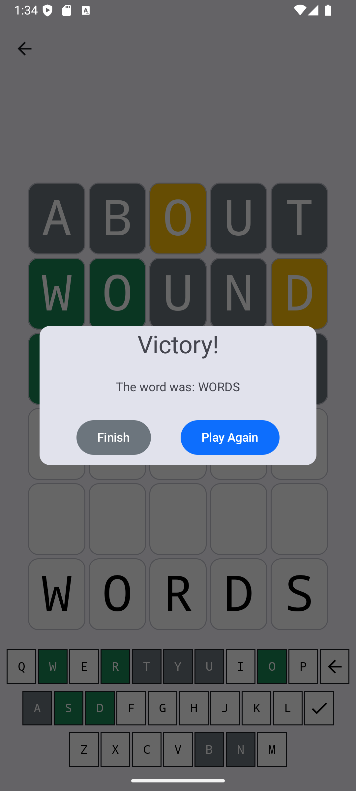

# Words

Words is a free, open source Wordle clone.

- No ads
- No internet connection required
- Dark mode support

## TODO

- Landscape mode
- Better dark mode support on the game screen
- Better support for large screens
- Setting to adjust the number of attempts
- Setting to adjust the target word length
- Setting to enable/disable hints

## Credits

This app uses the Github icon provided by Github, per their [terms of use](https://github.com/logos).

Other icons are provided by Google under Apache License Version 2.0 as part of their [Material Icons](https://developers.google.com/fonts/docs/material_icons) library.

The source code for this app itself is GPLv3 licensed. See the [LICENSE file](./LICENSE).

The app's default word list is provided by [Heroku App's API](https://random-word-api.herokuapp.com/home).